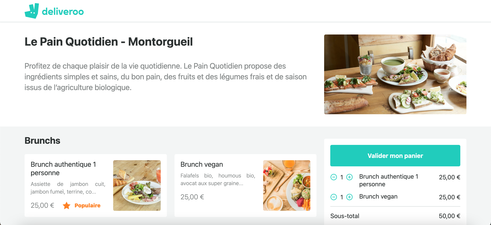

<h1 align="center">DELIVEROO FRONT END 🍔🍟🍕🧁🍩</h1>

<p align="center" style="font-style: italic">Copy of takeaway website Deliveroo.</p>


<br/>
<!--<p align="center"><a href="https://deliveroooooooo.netlify.app/">See the project</a></p>-->

## Installation

1. Clone the repo

2. Install NPM packages

   ```sh
   yarn
   ```

3. Run the project

   ```JS
   yarn start
   ```

4. Enjoy 🎇
   ```JS
   http://localhost:3000/
   ```
